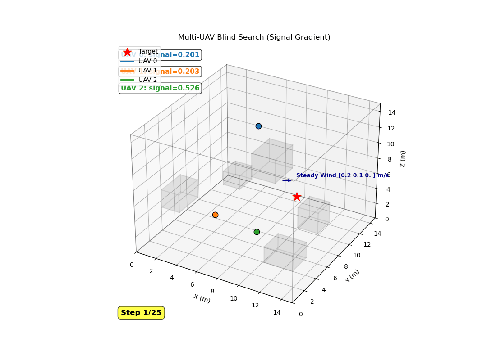
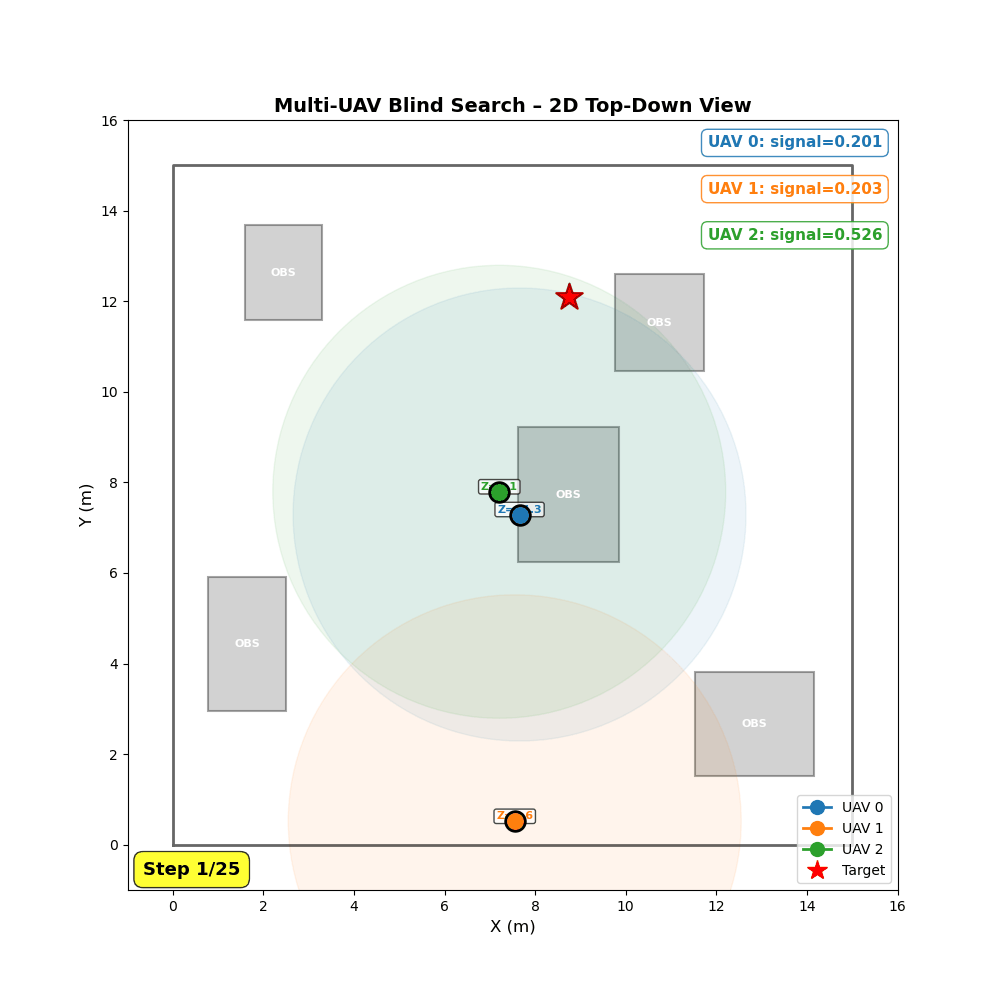

# 基于 PPO 的多智能体协同盲搜索

> 在三维有障碍、复合风场环境下，使用参数共享 PPO 训练多架无人机协同搜索隐藏目标。

本项目包含完整的实验代码、结果与报告。三架同构无人机在 15 m³ 的障碍空间中，仅凭标量信号强度感知目标远近，在稳态风与突发阵风的干扰下，从零学习协同搜索策略。

---

## 核心实验结果

| 指标 | 固定种子测试（20 局） | 完全随机测试（50 局） |
|------|----------------------|----------------------|
| **成功率** | **100 %** | **100 %** |
| **平均发现步数** | **15.8 ± 15.5 步** | **19.2 ± 17.0 步** |
| **平均回合回报** | **+528.7 ± 25.5** | **+534.3 ± 25.3** |

发现：

- **连续动作空间**是决定性改进：从 7 维离散动作改为 9 维连续向量后，成功率从 20 % → **100 %**，平均步数从 344 降至 **约 10 步**。
- **信号梯度塑形奖励**（不依赖目标方向先验）比带噪声的方向向量更鲁棒，平均回报从 +50 提升到 **+520**。
- **参数共享 PPO** 使三架无人机自发分散覆盖不同扇区，无需显式通信协议。
- 在极端阵风（最大 **3.87 m/s**，接近无人机最大速度 4 倍）下，只有 RL 策略能从偏移状态恢复并重新定位目标；启发式基线全部超时。

---

## 🎬 动态轨迹演示

### 三维搜索轨迹（2 fps）



三架无人机从不同边界出发，依据信号强度梯度调整航向，最终在第 25 步发现目标。每帧左上角实时显示各机信号强度。

### 二维俯视图与覆盖地图（2 fps）



X-Y 平面投影更清晰地展示了多机协同覆盖逻辑：三架无人机分别覆盖下-中、左-中、右-上三个扇区，视野圆圈的盲区互补，协同效率显著。

---

## 仓库结构

```
final3/
├── README.md                  # 本文件
├── outline.md                 # 完整实验报告（中文）
├── requirements.txt           # Python 依赖
│
├── src/                       # 源代码
│   ├── search_env.py          # 三维多无人机搜索环境
│   ├── train_ppo.py           # PPO 训练脚本（SB3，中心化多智能体）
│   ├── train_ppo_single.py    # PPO 单智能体消融训练脚本
│   ├── train_ppo_decentralized.py  # PPO 去中心化注意力训练脚本
│   ├── train_a2c.py           # A2C 基线训练脚本
│   ├── evaluate.py            # 固定种子评估与统计
│   ├── evaluate_a2c.py        # A2C 评估
│   ├── evaluate_stats.py      # 带标准差的统计评估脚本
│   ├── visualize.py           # 三维轨迹静态图与 GIF 生成
│   ├── visualize_2d.py        # 二维俯视图覆盖地图
│   ├── compare_convergence.py # PPO vs A2C 收敛曲线
│   ├── plot_baseline.py       # 启发式基线对比柱状图
│   ├── annotate_windy.py      # 风扰轨迹标注工具
│   ├── render_mermaid_clean.py  # Mermaid 图表渲染脚本（透明背景、自动裁剪）
│   └── format_docx.py         # Word 文档格式化脚本（三线表、字体、行距）
│
├── .gitignore                 # Git 忽略规则
├── outline.docx               # 实验报告 Word 版（三线表、宋体小四、1.25 倍行距）
│
├── assets/                    # 实验结果与可视化
│   ├── training/              # 训练曲线、仪表盘、消融对比
│   ├── trajectories_3d/       # 三维轨迹与关键帧
│   ├── trajectories_2d/       # 二维覆盖地图与关键帧
│   ├── comparison/            # 算法对比与基线对比
│   └── gifs/                  # 动态轨迹 GIF
│
├── data/
│   └── trajectories/          # 可视化用的轨迹 CSV/JSON
│
└── models/
    ├── ppo_search_final.zip   # PPO 最终模型（100 万步）
    └── a2c_search_final.zip   # A2C 最终模型（100 万步）
```

---

## 快速开始

### 1. 环境配置

```bash
# 推荐 conda 环境
conda create -n rl_env python=3.10
conda activate rl_env
pip install -r requirements.txt
```

> **注意**：训练纯 CPU 即可，约 19 分钟，无需 GPU。

### 2. 训练 PPO 策略

```bash
cd src
python train_ppo.py --timesteps 1000000
```

### 3. 评估

```bash
python evaluate.py          # 20 局固定种子
python evaluate_a2c.py      # A2C 基线
```

### 4. 可视化

```bash
# 三维轨迹（静态 PNG + 动态 GIF）
python visualize.py \
    --csv ../data/trajectories/viz_seed1.csv \
    --world ../data/trajectories/viz_seed1.json \
    --out ../assets/gifs/search_3d_v3 \
    --gif

# 二维俯视图
python visualize_2d.py \
    --csv ../data/trajectories/viz_seed1.csv \
    --world ../data/trajectories/viz_seed1.json \
    --out ../assets/gifs/search_2d_v3

# 对比实验图
python compare_convergence.py
python plot_baseline.py
```


## 技术栈

- **Python 3.10**
- **NumPy** – 环境物理与碰撞检测
- **Stable-Baselines3** – PPO / A2C 算法实现
- **Matplotlib** – 静态图与动画
- **Pillow** – 图像标注

---
